# Agentic RAG Regulatory Compliance Advisor
### **EU AI Act & OECD AI Principles Compliance Agent**

**Master IIBDCC — Systèmes Multi-Agents (SMA) & Intelligence Artificielle Distribuée (IAD)**  
**Professeur Responsable :** Mme. Sara RETAL  
**Réalisé par :** **HYNDI ELMEHDI**  

---

## 📌 Présentation du Projet
Ce projet consiste en la conception et le développement d'un système **Agentic RAG (Retrieval-Augmented Generation)** pour conseiller les entreprises sur la conformité réglementaire de l'**EU AI Act** (Loi européenne sur l'IA) et des **Principes de l'OCDE sur l'IA**. 

Contrairement aux systèmes RAG classiques et linéaires (Query ➔ Retrieve ➔ Generate), ce système s'appuie sur un agent intelligent orchestré par **LangGraph**. Il intègre une boucle décisionnelle dynamique, une sélection intelligente d'outils, ainsi que de l'auto-correction (Corrective RAG) pour garantir des réponses fiables et rigoureusement fondées (sans hallucinations).

---

## ⚙️ Architecture du Graphe LangGraph
Le système est modélisé sous la forme d'un automate à états fini (State Machine) où chaque nœud représente une action et chaque transition dépend de règles et d'évaluations précises (Conditional Edges) :

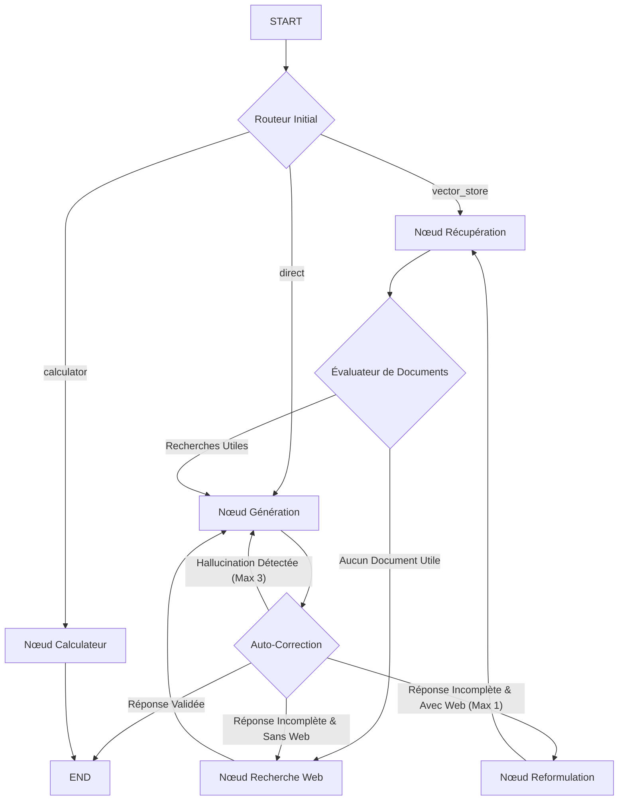

### 🗺️ Carte d'Architecture Réelle (Générée par LangGraph)
Le graphe est compilé de manière dynamique et son architecture visuelle est automatiquement exportée :

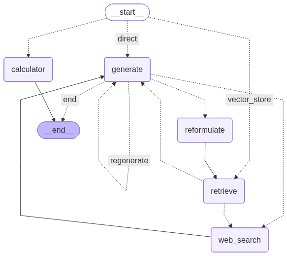

---

## 🚀 Fonctionnement Détaillé du Flux (Workflow)

1. **Aiguillage Initial (`route_question`)** :
   * **Calculateur de Pénalités** : Si la requête fait référence à des chiffres de chiffre d'affaires (turnover) et des violations, elle est redirigée directement vers l'outil mathématique.
   * **Recherche Vectorielle (RAG)** : Si la requête pose des questions de conformité réglementaire générale.
   * **Direct** : Pour les salutations et les échanges généraux sans besoin de documents.

2. **Récupération & Filtrage strict (`retrieve` + `grade_documents`)** :
   * Les documents locaux sont recherchés dans une base de données vectorielle locale **Chroma DB** (construite via des plongements `all-MiniLM-L6-v2` locaux).
   * Un évaluateur strict vérifie si les documents contiennent la réponse spécifique. S'ils sont hors sujet, le système bascule de manière autonome vers la **Recherche Web (Tavily/DuckDuckGo)**.

3. **Génération & Auto-Correction en boucle (`generate` + `grade_generation`)** :
   * L'agent vérifie s'il y a des **hallucinations** (les faits générés doivent être strictement inclus dans le contexte fourni).
   * L'agent évalue la **complétude** de la réponse. Si elle est incomplète, le graphe tente de **reformuler la requête** pour chercher de nouveaux indices ou passe à la **recherche sur le web en direct** si ce n'est pas encore fait.

---

## 📁 Structure du Projet

```bash
agentic-ai-evaluation/
├── data/
│   ├── eu_ai_act_summary.md          # Synthèse structurée de l'EU AI Act
│   └── oecd_ai_principles.md         # Synthèse structurée des Principes OCDE
├── src/
│   ├── __init__.py
│   ├── vector_store.py               # Ingestion, découpage (chunks) et indexation Chroma
│   ├── tools.py                      # Outils (Retriever, Calculateur de pénalités, Tavily Search)
│   ├── state.py                      # Définition du dictionnaire d'état (AgentState)
│   ├── graph.py                      # Définition des nœuds, transitions et compilation du graphe
│   └── evaluation.py                 # Suite de tests automatiques (10 simples + 10 complexes)
├── app.py                            # Interface utilisateur interactive Streamlit & Diagnostics
├── requirements.txt                  # Dépendances Python
├── .env                              # Clés d'API (Gemini, Groq, Tavily)
├── README.md                         # Ce fichier explicatif
└── assets/                           # Graphiques et métriques exportés
    ├── graph_architecture.png        # Architecture du graphe LangGraph
    ├── evaluation_charts.png         # Graphique de l'évaluation (Temps et Étapes)
    └── evaluation_metrics.csv        # Données d'évaluation brutes au format CSV
```

---

## 📸 Captures d'Écran et Démonstrations

### 1. Réponses Réglementaires & Sources RAG
Démonstration de la recherche documentaire et de l'affichage interactif des sources citées :

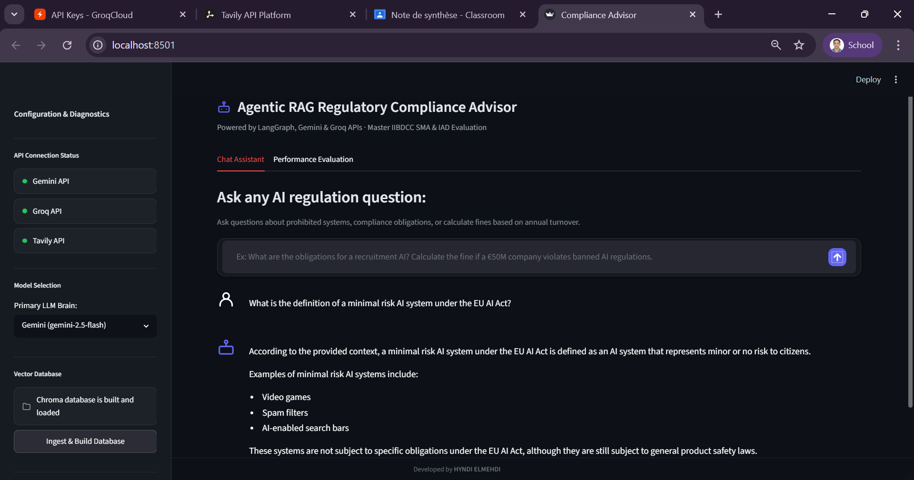

*L'agent trouve les réponses dans la base vectorielle locale et cite le fichier source correspondant.*

### 2. Routage et Calculateur de Pénalités
Exemple de routage automatique vers l'outil de calcul pour estimer l'amende maximale sous l'EU AI Act en fonction du chiffre d'affaires mondial de l'entreprise :

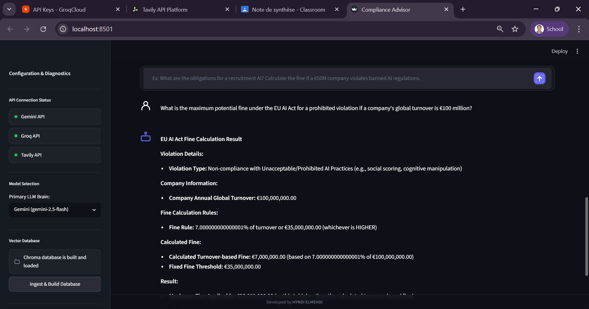
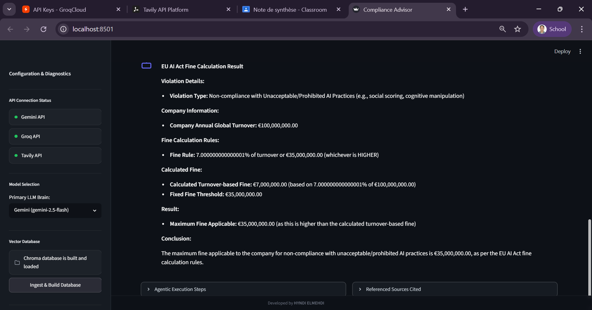

*L'agent extrait les variables et applique la formule réglementaire avec une exactitude mathématique totale.*

### 3. Raisonnement Complexe & Analyse Multi-Documents
Traitement de questions à étapes nécessitant d'associer plusieurs principes ou de comparer des articles :

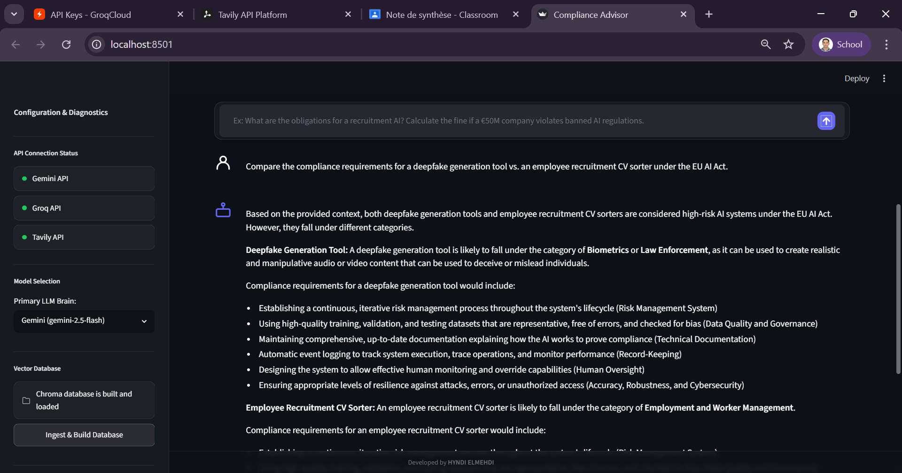
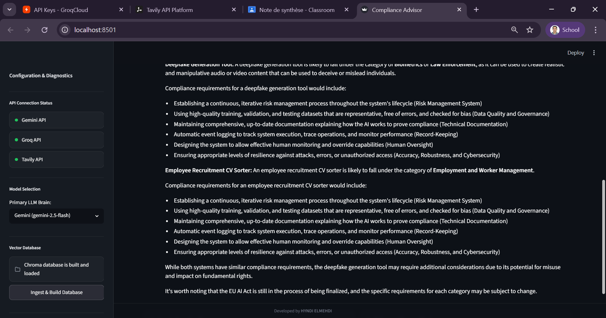

---

## 🚀 Simulation et Exécution Locale

### Étape 1 : Installation des Dépendances
Dans votre terminal de commandes, installez le package des dépendances requises :
```bash
pip install -r requirements.txt
```

### Étape 2 : Configuration de l'environnement `.env`
Créez ou modifiez le fichier `.env` à la racine pour renseigner vos jetons d'accès API :
```env
GEMINI_API_KEY="votre_cle_gemini"
GROQ_API_KEY="votre_cle_groq"
TAVILY_API_KEY="votre_cle_tavily"
```

### Étape 3 : Alimentation de la Base de Données Vectorielle
Pour parser, découper et indexer les synthèses réglementaires dans Chroma DB, exécutez :
```bash
python src/vector_store.py
```
*(Alternative : Vous pouvez cliquer sur le bouton **⚡ Ingest & Build Database** dans l'application web)*

### Étape 4 : Lancer l'Application Streamlit
Démarrez l'application web et de diagnostic :
```bash
streamlit run app.py
```
L'interface s'ouvre automatiquement à l'adresse locale `http://localhost:8501`.

---

## 📊 Suite d'Évaluation de Performance
Pour évaluer le système de manière quantitative et respecter le cahier des charges académique, le script `src/evaluation.py` exécute **10 requêtes simples** et **10 requêtes complexes** afin de mesurer le temps d'exécution (latence) et le nombre de nœuds traversés.

Vous pouvez lancer l'évaluation en ligne de commande :
```bash
python src/evaluation.py
```
*(Ou en cliquant sur **🚀 Run Automated Evaluation Suite** depuis l'onglet dédié de l'interface Streamlit)*

### Graphiques & Captures de la Suite d'Évaluation
* **Comparaison Générale (Temps & Étapes) :**  
  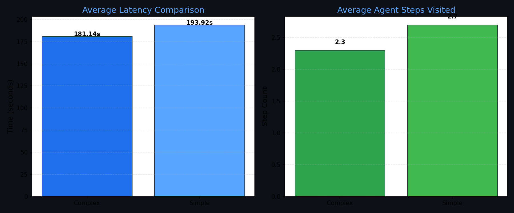

* **Configuration & État des Clés d'API (Streamlit) :**  
  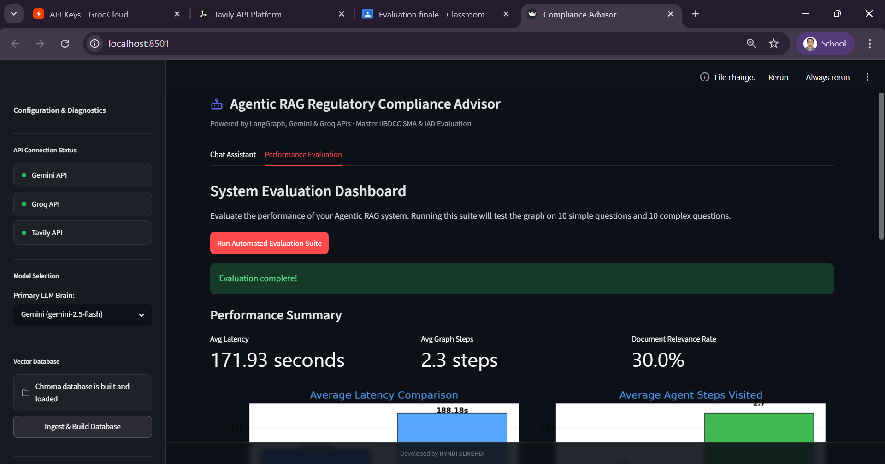

* **Tableau de Bord des Performances (Streamlit) :**  
  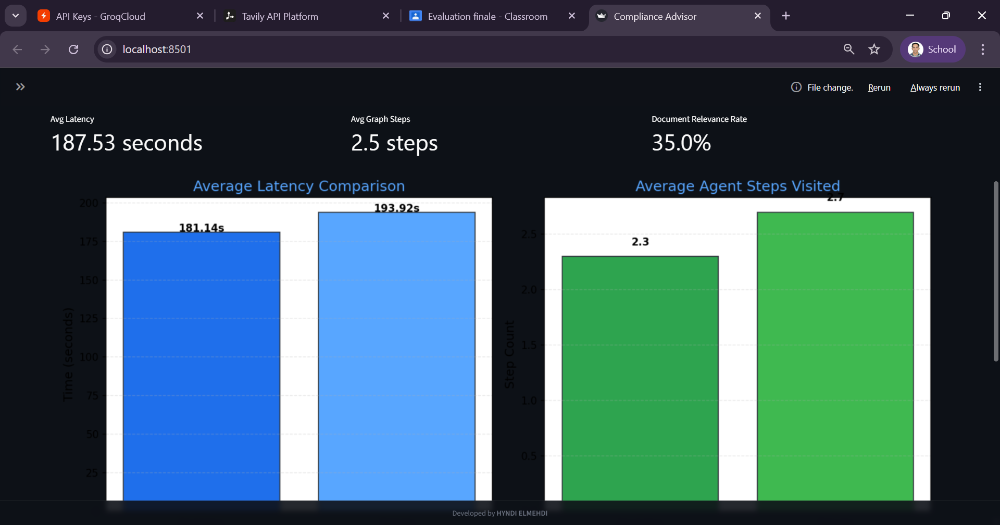

* **Tableau Complet des Métriques (20 cas de tests avec réponses) :**  
  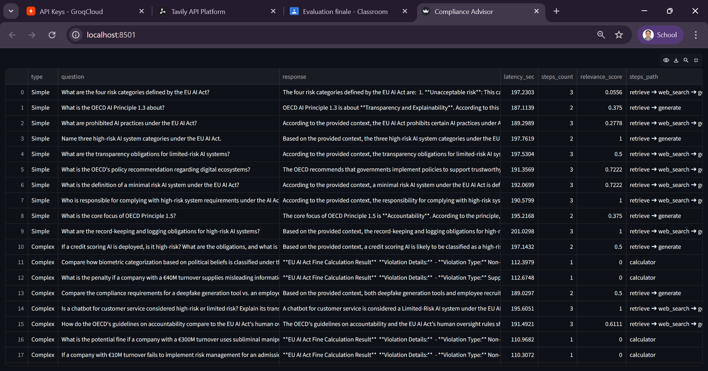


